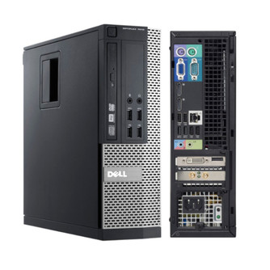
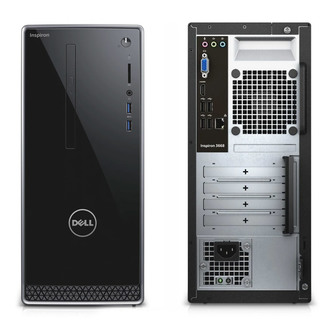

# Multi-site Homelab

> A three-node homelab deployed across two physical locations at **Wayne State University (WSU)** — a dorm room and a university lab — covering architecture, networking, security, and day-to-day operations.

> [!NOTE]
> All sensitive details (IPs, credentials, keys, MAC addresses) are intentionally redacted.

---

## Table of Contents

- [Sites Overview](#sites-overview)
- [University Network](#university-network)
- [Hardware Inventory](#hardware-inventory)
- [Network Architecture](#network-architecture)
- [Inter-Site Connectivity](#inter-site-connectivity)
- [DHCP Reservations](#dhcp-reservations)
- [Remote Access (SSH)](#remote-access-ssh)
- [Services](#services)
- [Roadmap](#roadmap)

---

## Sites Overview

| Site | Location | Nodes | Role |
|:-----|:---------|:-----:|:-----|
| **Site A** | WSU Dorm Room | 2 | Primary compute + storage |
| **Site B** | WSU Lab | 1 | Remote node |

Both sites sit behind Wayne State University's campus network.

---

## University Network

Both sites connect to the internet through **Wayne State University's network infrastructure**.

### Available Networks

| Network | Type | Access | Notes |
|:--------|:-----|:-------|:------|
| **Dorm Wall Ethernet** | Wired | Dorm rooms only | Used by Site A — plugged into personal router |
| **eduroam** | Wi-Fi (WPA2-Enterprise) | Campus-wide | Education roaming — works at any eduroam-participating university worldwide |
| **WSU Secure** | Wi-Fi (WPA2-Enterprise) | Campus-wide | WSU's primary secured wireless network |

### Implications for the Homelab

| Concern | Impact | Workaround |
|:--------|:-------|:-----------|
| **University NAT** | Servers share WSU's public IP — no direct inbound access | VPN/tunnel (Tailscale, Cloudflare Tunnel, WireGuard) |
| **Different subnets** | Dorm and lab are on separate VLANs — sites can't reach each other by private IP | Mesh VPN (Tailscale) to bridge sites |
| **Blocked ports** | WSU likely blocks inbound SSH (22), HTTP (80), HTTPS (443) | Tunnel or reverse proxy for external access |
| **Wi-Fi limitations** | DHCP churn, timeouts, device limits on eduroam/WSU Secure | Wired connections for servers; Wi-Fi only for personal devices |

---

## Hardware Inventory

### Site A — WSU Dorm Room

#### Node 1: Dell OptiPlex 7010 — `homeserver`

<p align="center">
  
</p>

| Spec | Details |
|:-----|:--------|
| **Hostname** | `homeserver` |
| **Form Factor** | SFF / MT |
| **Motherboard** | Dell 0GXM1W (Q77 Express chipset) |
| **CPU** | Intel Core i5-3570 @ 3.40 GHz (4C/4T, Ivy Bridge) |
| **RAM** | 16 GB DDR3 1600 MHz (2 x 8 GB DIMM, expandable to 32 GB) |
| **GPU** | NVIDIA GeForce GTX 1050 Ti (GP107) |
| **Storage** | 240 GB Kingston A400 SSD |
| **Partitions** | 1 GB EFI / 2 GB EXT4 / 220 GB root |
| **NIC** | Intel 82579LM GbE |
| **MAC Address** | `<REDACTED>` |
| **Private IP** | `192.168.1.x` (reserved) |
| **Tailscale IP** | `100.x.x.x` |
| **OS** | Ubuntu *(version TBD)* |
| **Role** | *TBD* |

---

#### Node 2: Dell Inspiron 3668 — `homserver2`

<p align="center">
  
</p>

> [!NOTE]
> Originally referred to as "Precision 3668" — hardware identifies as Dell Inspiron 3668 (Model 0763).

| Spec | Details |
|:-----|:--------|
| **Hostname** | `homserver2` |
| **Form Factor** | Desktop Tower |
| **Motherboard** | Dell 07KY25 (H110 chipset) |
| **CPU** | Intel Core i5-7400 @ 3.00 GHz (4C/4T, Kaby Lake) |
| **RAM** | 32 GB DDR4 2400 MHz (2 x 16 GB DIMM) |
| **GPU (Discrete)** | NVIDIA RTX A2000 12 GB (GA106) |
| **GPU (Integrated)** | Intel HD Graphics 630 |
| **Storage** | 250 GB Crucial MX500 SSD |
| **Partitions** | 1 GB EFI / 2 GB EXT4 / 229 GB root |
| **NIC (Wired)** | Realtek RTL8111/8168 GbE |
| **NIC (Wireless)** | Qualcomm QCA9565 / AR9565 |
| **Bluetooth** | Yes (USB) |
| **Optical** | DVD+-RW (DU-8A5LH) |
| **MAC Address** | `<REDACTED>` |
| **Private IP** | `192.168.1.x` (reserved) |
| **Tailscale IP** | `100.x.x.x` |
| **OS** | Ubuntu 22.04 LTS |
| **Role** | *TBD* |

---

### Site B — WSU Lab

#### Node 3: Apple Mac Mini

<p align="center">
  
</p>

| Spec | Details |
|:-----|:--------|
| **Hostname** | *TBD* |
| **Form Factor** | Mac Mini |
| **CPU** | Apple M2 (8-core CPU / 10-core GPU) |
| **RAM** | 16 GB Unified Memory |
| **Storage** | *TBD* |
| **NIC** | *TBD* |
| **MAC Address** | *TBD* |
| **Private IP** | *TBD* |
| **Tailscale IP** | *TBD* |
| **OS** | macOS |
| **Role** | Web server (portfolio) + development (SSH) |
| **Domain** | `*.tahabilder.com` (subdomains) |
| **Public Access** | Via **Cloudflare Tunnel** — serves web projects to the public |
| **Dev Access** | SSH for development and deployment |

---

## Network Architecture

### IP Addressing (Site A)

| Device | Hostname | MAC Address | Private IP | Tailscale IP | Status |
|:-------|:---------|:------------|:-----------|:-------------|:-------|
| Dell OptiPlex 7010 | `homeserver` | `<REDACTED>` | `192.168.1.x` | `100.x.x.x` | Reserved |
| Dell Inspiron 3668 | `homserver2` | `<REDACTED>` | `192.168.1.x` | `100.x.x.x` | Reserved |
| Windows PC | `homepc` | `<REDACTED>` | `192.168.1.x` | `100.x.x.x` | Reserved |
| Router (gateway) | — | — | `192.168.1.1` | — | — |

### IP Addressing (Site B)

| Device | Hostname | MAC Address | Private IP | Tailscale IP | Status |
|:-------|:---------|:------------|:-----------|:-------------|:-------|
| Apple Mac Mini | *TBD* | *TBD* | *TBD* | *TBD* | *TBD* |

### Network Topology

```
 ┌──────────────────────────────────────────────────────────────────────────┐
 │                              INTERNET                                    │
 └──────────────────────────────────┬───────────────────────────────────────┘
                                    │
                     ┌──────────────┴──────────────┐
                     │     WSU Campus Network       │
                     │     (NAT / Firewall)         │
                     │                              │
                     │  Wi-Fi: eduroam, WSU Secure  │
                     └──────┬──────────────┬────────┘
                            │              │
             ┌──────────────┘              └──────────────┐
             │ (Dorm Ethernet)              (Lab Network) │
 ════════════╪═══════════════════     ═══════════════════╪═══════════
  SITE A     │   WSU Dorm Room          SITE B       WSU Lab
             │                                          │
    ┌────────┴────────┐                        ┌────────┴────────┐
    │  Dorm Wall Jack │                        │  Lab Network    │
    │  (Ethernet)     │                        │  Port / Switch  │
    └────────┬────────┘                        └────────┬────────┘
             │                                          │
    ┌────────┴────────┐                        ┌────────┴────────┐
    │  Personal       │                        │    Mac Mini     │
    │  Router         │                        │    (Node 3)     │
    │  192.168.1.1    │                        └─────────────────┘
    └──┬─────┬─────┬──┘
       │     │     │
 ┌─────┴───┐ │ ┌──┴──────────┐
 │OptiPlex │ │ │  Inspiron   │
 │ 7010    │ │ │  3668       │
 │(Node 1) │ │ │ (Node 2)   │
 └─────────┘ │ └─────────────┘
        ┌────┴─────┐
        │ homepc   │
        │ (Windows)│
        └──────────┘

 Legend:
   Site A LAN : 192.168.1.0/24 (behind personal router)
   Site B     : Directly on WSU lab network
   Both sites : Behind WSU campus NAT
   All nodes  : Connected via Tailscale mesh VPN
```

---

## Inter-Site Connectivity

**Site B (Mac Mini)** is publicly accessible via **Cloudflare Tunnel**, serving portfolio projects on `*.tahabilder.com` subdomains. This bypasses WSU's NAT/firewall without needing port forwarding.

**Site A and Site B** are connected via **Tailscale**, a mesh VPN that works behind NAT. All nodes can reach each other using their Tailscale IPs regardless of physical location or university network restrictions.

### Tailscale Network

All machines are enrolled under a single Tailscale account.

| Machine | Tailscale IP | OS | Status |
|:--------|:-------------|:---|:-------|
| `homepc` | `100.x.x.x` | Windows 11 | Connected |
| `homeserver` | `100.x.x.x` | Linux | Connected |
| `homserver2` | `100.x.x.x` | Linux | Connected |

### Connectivity Status

| Site | LAN Access | Remote Access | Method |
|:-----|:-----------|:--------------|:-------|
| **Site A** (Dorm) | Working | Working | Tailscale mesh VPN |
| **Site B** (Lab) | Working | Working | Cloudflare Tunnel → `*.tahabilder.com` |

---

## DHCP Reservations

DHCP reservations have been configured on the Site A router so that each device always receives the same IP address after a reboot.

> [!TIP]
> DHCP reservation (configured on router) is the simpler approach and is already done. Only use Netplan static IP if you move a server to a different network or need the IP to be independent of the router.

| Device | MAC Address | Reserved IP | Status |
|:-------|:------------|:------------|:------:|
| `homepc` (Windows PC) | `<REDACTED>` | `192.168.1.x` | Enabled |
| `homeserver` (OptiPlex 7010) | `<REDACTED>` | `192.168.1.x` | Enabled |
| `homserver2` (Inspiron 3668) | `<REDACTED>` | `192.168.1.x` | Enabled |

<details>
<summary><strong>Alternative: Static IP via Netplan</strong></summary>

If you ever need to set a static IP directly on the server (e.g., bypassing DHCP), edit the Netplan config:

```bash
sudo nano /etc/netplan/01-netcfg.yaml
```

**Example config:**

```yaml
network:
  version: 2
  ethernets:
    <interface>:           # e.g. eno1, enp2s0
      dhcp4: no
      addresses:
        - 192.168.1.x/24   # replace with actual IP
      routes:
        - to: default
          via: 192.168.1.1
      nameservers:
        addresses: [8.8.8.8, 1.1.1.1]
```

Apply changes:

```bash
sudo netplan apply
```

</details>

---

## Remote Access (SSH)

### Prerequisites

- An SSH client (`ssh` on Linux/macOS, OpenSSH or PuTTY on Windows)
- Your private key (corresponding to the public key deployed on each node)

### SSH Key Setup

1. **Generate a key pair** (if you don't have one):

   ```bash
   ssh-keygen -t ed25519 -C "homelab"
   ```

   This creates:
   - `~/.ssh/id_ed25519` — private key (keep secret, never share)
   - `~/.ssh/id_ed25519.pub` — public key (deploy to servers)

2. **Copy public key to a server**:

   ```bash
   ssh-copy-id -i ~/.ssh/id_ed25519.pub <user>@<server-ip>
   ```

### Connecting to Nodes

#### From the dorm LAN (same router)

```bash
ssh <user>@192.168.1.x    # homeserver (OptiPlex 7010)
ssh <user>@192.168.1.x    # homserver2 (Inspiron 3668)
```

#### From anywhere (via Tailscale)

```bash
ssh <user>@100.x.x.x      # homeserver (OptiPlex 7010)
ssh <user>@100.x.x.x      # homserver2 (Inspiron 3668)
```

> [!IMPORTANT]
> Requires Tailscale to be running on both your client machine and the target node.

### SSH Config (recommended)

Add to `~/.ssh/config` for quick access:

```ssh-config
# ── Site A — WSU Dorm (LAN) ──

Host homeserver
    HostName 192.168.1.x
    User <user>
    Port 22
    IdentityFile ~/.ssh/id_ed25519

Host homserver2
    HostName 192.168.1.x
    User <user>
    Port 22
    IdentityFile ~/.ssh/id_ed25519

# ── Tailscale (remote access from anywhere) ──

Host ts-homeserver
    HostName 100.x.x.x
    User <user>
    Port 22
    IdentityFile ~/.ssh/id_ed25519

Host ts-homserver2
    HostName 100.x.x.x
    User <user>
    Port 22
    IdentityFile ~/.ssh/id_ed25519

# ── Site B — WSU Lab ──

Host macmini
    HostName <TBD>
    User <TBD>
    Port 22
    IdentityFile ~/.ssh/id_ed25519
```

Then connect with:

```bash
ssh homeserver           # LAN
ssh homserver2           # LAN
ssh ts-homeserver        # Tailscale (remote)
ssh ts-homserver2        # Tailscale (remote)
ssh macmini              # Site B
```

### SSH Hardening Checklist

- [ ] Disable password authentication (`PasswordAuthentication no`)
- [ ] Disable root login (`PermitRootLogin no`)
- [ ] Use key-based auth only
- [ ] Change default SSH port (optional)
- [ ] Install `fail2ban` for brute-force protection
- [ ] Restrict SSH to specific users (`AllowUsers <user>`)

---

## Services

### Site B — Mac Mini

| Service | Description | Access |
|:--------|:------------|:-------|
| **Portfolio / Web Projects** | Hosts deployed web projects | Public via Cloudflare Tunnel → `*.tahabilder.com` |
| **SSH (Dev)** | Remote development access | SSH (details TBD) |
| **Cloudflare Tunnel** | Tunnels web traffic from Cloudflare edge to Mac Mini | Runs as daemon on Mac Mini |

### Site A — Dorm (Planned)

*Coming soon — will document Docker containers, VMs, and applications running on each node as they are deployed.*

---

## Roadmap

- [ ] Add product images to `docs/images/`
- [ ] Fill in Mac Mini specs (Site B)
- [x] Set up inter-site VPN (Tailscale)
- [ ] Configure SSH key-based auth and hardening
- [ ] Deploy initial services (Docker, etc.)
- [ ] Document backup strategy
- [ ] Set up monitoring and alerting
- [ ] Configure firewall rules (UFW)
- [ ] Document storage expansion plans
- [ ] Disaster recovery plan
